# M5StickC Plus2 BLE Remote

<p align="center">
  
</p>

A little Bluetooth remote for your PC, running on an M5StickC Plus2. It pairs as a
standard BLE keyboard (no dongle, no driver) and gives you media keys, volume, a
mic-mute button for calls, presentation controls and a few Windows shortcuts,
split across pages you flip through on the screen.

I made it because I was tired of alt-tabbing just to pause music or mute my mic in
Discord while gaming.

## Features

- Pairs as a BLE keyboard (works on Windows/macOS/Linux)
- 5 pages, switch with **A+B together**:
  - **Media** – play/pause, mute, next / previous track
  - **Volume** – up / down (hold to repeat)
  - **Call** – mute mic + deafen/camera (Discord / Teams / Meet / Zoom presets)
  - **Slides** – next / previous, start / exit slideshow
  - **Macros** – screenshot, lock, show desktop, file explorer (Windows)
- Shake the stick to mute your mic from any page
- Reports its battery level to the host
- Flicker-free UI (rendered to an off-screen canvas)

## Hardware

Just an **M5StickC Plus2**. Nothing to wire.

## Controls

| Page   | A            | Hold A         | B              | Hold B      |
|--------|--------------|----------------|----------------|-------------|
| Media  | Play / Pause | Mute           | Next           | Previous    |
| Volume | Volume +     | (repeat)       | Volume −       | (repeat)    |
| Call   | Mute mic     | —              | Deafen / Cam   | —           |
| Slides | Next         | Start (F5)     | Previous       | Exit (Esc)  |
| Macros | Screenshot   | Show desktop   | Lock           | Explorer    |

Change page: press **A and B at the same time**.

## Build & flash

Built with [PlatformIO](https://platformio.org/).

```
pio run -t upload
```

Or open the folder in VS Code with the PlatformIO extension and hit Upload. Then
pair "M5 StickC Remote" from your PC's Bluetooth settings.

## Config

Everything lives in `include/config.h`:

- `CALL_APP` – `1` Discord / `2` Teams / `3` Meet / `4` Zoom (picks the mute/cam shortcuts)
- `SHAKE_TO_MUTE`, `SHAKE_THRESHOLD` – shake-to-mute gesture
- `BLE_NAME`, screen rotation/brightness, buzzer volume

## A note about the mute button

The call actions send app shortcuts (e.g. Discord's `Ctrl+Shift+M`). Those only
fire when the app is focused. To mute while you're in a game, set them as a
**global keybind** in the app instead — for Discord: Settings → Keybinds →
Toggle Mute → `Ctrl+Shift+M`.

## License

MIT
